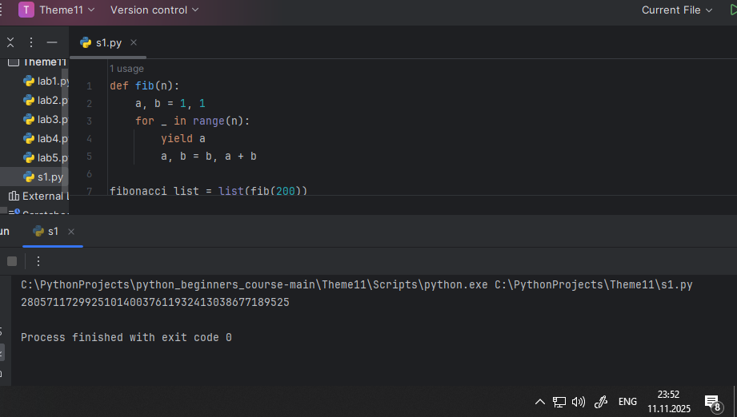

# Тема 8. Основы объектно-ориентированного программирования
Отчет по Теме #8 выполнила:
- Шкабара Злата Александровна
- ПИЭ-23-1

| Задание | Лаб_раб | Сам_раб |
| ------ |---------|---------|
| Задание 1 | +       | +       |
| Задание 2 | +       | +       |
| Задание 3 | +       | +       |
| Задание 4 | +       | +       |
| Задание 5 | +       | +       |

знак "+" - задание выполнено; знак "-" - задание не выполнено;


## Лабораторная работа №1
### Создайте класс “Car” с атрибутами производитель и модель. Создайте объект этого класса. Напишите комментарии для кода, объясняющие его работу. Результатом выполнения задания будет листинг кода с комментариями.

```python
class Car:  # создали класс Car
    def __init__(self, make, model):  # определили конструктор класса
        self.make = make  # установили атрибут make (марка автомобиля)
        self.model = model  # установили атрибут model (модель автомобиля)

my_car = Car("Toyota", "Corolla")  # создали объект my_car класса Car
```
### Результат.


### Выводы
Создали класс “Car” с атрибутами производитель и модель.

## Лабораторная работа №2
### Дополните код из первого задания, добавив в него атрибуты и методы класса, заставьте машину “поехать”. Напишите комментарии для кода, объясняющие его работу. Результатом выполнения задания будет листинг кода с комментариями и получившийся вывод в консоль.

```python
class Car:  # создали класс Car
    def __init__(self, make, model):  # определили конструктор класса
        self.make = make  # установили атрибут make (марка автомобиля)
        self.model = model  # установили атрибут model (модель автомобиля)

    def drive(self):  # создали метод drive
        print(f"Driving the {self.make} {self.model}")  # выводим сообщение о вождении

my_car = Car("Toyota", "Corolla")  # создали объект my_car класса Car
my_car.drive()  # вызвали метод drive для объекта my_car
```
### Результат.


### Выводы
добавили метод drive


## Лабораторная работа №3
### Создайте новый класс “ElectricCar” с методом “charge” и атрибутом емкость батареи. Реализуйте его наследование от класса, созданного в первом задании. Заставьте машину поехать, а потом заряжаться. Результатом выполнения задания будет листинг кода с комментариями и получившийся вывод в консоль.

```python
class Car:  # создали класс Car
    def __init__(self, make, model):  # определили конструктор класса
        self.make = make  # установили атрибут make (марка автомобиля)
        self.model = model  # установили атрибут model (модель автомобиля)

    def drive(self):  # создали метод drive
        print(f"Driving the {self.make} {self.model}")  # выводим сообщение о вождении

my_car = Car("Toyota", "Corolla")  # создали объект my_car класса Car
my_car.drive()  # вызвали метод drive для объекта my_car

class ElectricCar(Car):  # создали класс ElectricCar, наследующий от Car
    def __init__(self, make, model, battery_capacity):  # определили конструктор
        super().__init__(make, model)  # вызвали конструктор родительского класса
        self.battery_capacity = battery_capacity  # установили атрибут battery_capacity

    def charge(self):  # создали метод charge
        print(f"Charging the {self.make} {self.model} with {self.battery_capacity} kWh")  # вывели сообщение о зарядке

my_electric_car = ElectricCar("Tesla", "Model S", 75)  # создали объект ElectricCar
my_electric_car.drive()  # вызвали унаследованный метод drive
my_electric_car.charge()  # вызвали метод charge
```
### Результат.


### Выводы
Создали новый класс “ElectricCar” с методом “charge” и атрибутом емкость батареи


## Лабораторная работа №4
### Реализуйте инкапсуляцию для класса, созданного в первом задании.Создайте защищенный атрибут производителя и приватный атрибут модели. Вызовите защищенный атрибут и заставьте машину поехать. Напишите комментарии для кода, объясняющие его работу. Результатом выполнения задания будет листинг кода с комментариями и получившийся вывод в консоль.


```python
class Car:  # создали класс Car
    def __init__(self, make, model):  # определили конструктор класса
        self._make = make  # установили защищенный атрибут _make
        self.__model = model  # установили приватный атрибут __model

    def drive(self):  # создали метод drive
        print(f"Driving the {self._make} {self.__model}")  # выводим сообщение о вождении

my_car = Car("Toyota", "Corolla")  # создали объект my_car класса Car

print(my_car._make)  # обратились к защищенному атрибуту (работает)
my_car.drive()  # вызвали метод drive для объекта my_car
```
### Результат.


### Выводы
добавили инкапсуляцию, сделав атрибуты приватными


## Лабораторная работа №5
### Реализуйте полиморфизм создав основной (общий) класс “Shape”, а также еще два класса “Rectangle” и “Circle”. Внутри последних двух классов реализуйте методы для подсчета площади фигуры. После этого создайте массив с фигурами, поместите туда круг и прямоугольник, затем при помощи цикла выведите их площади. Напишите комментарии для кода, объясняющие его работу. Результатом выполнения задания будет листинг кода с комментариями и получившийся вывод в консоль.


```python
class Shape:  # создали базовый класс Shape
    def area(self):  # объявили метод area
        pass  # оставили заглушку

class Rectangle(Shape):  # создали класс Rectangle, наследующий от Shape
    def __init__(self, width, height):  # определили конструктор
        self.width = width  # установили ширину
        self.height = height  # установили высоту

    def area(self):  # переопределили метод area
        return self.width * self.height  # вычислили площадь прямоугольника

class Circle(Shape):  # создали класс Circle, наследующий от Shape
    def __init__(self, radius):  # определили конструктор
        self.radius = radius  # установили радиус

    def area(self):  # переопределили метод area
        return 3.14 * self.radius * self.radius  # вычислили площадь круга

my_rectangle = Rectangle(5, 4)  # создали объект прямоугольника
my_circle = Circle(5)  # создали объект круга

print(my_rectangle.area())  # вывели площадь прямоугольника
print(my_circle.area())  # вывели площадь круга
```
### Результат.


### Выводы
добавили два класса наследника, переопределили метод area, применив полиморфизм


## Самостоятельная работа №1
### Самостоятельно создайте класс и его объект. Они должны отличаться, от тех, что указаны в теоретическом материале (методичке) и лабораторных заданиях. Результатом выполнения задания будет листинг кода и получившийся вывод консоли.

```python

```
### Результат.



### Выводы

1. `class Phone:` создаем класс Phone
2. `def __init__(self, battery):` конструктор класса
3. `my_phone = Phone(100)` создаем объект класса
  
## Самостоятельная работа №2
### Самостоятельно создайте атрибуты и методы для ранее созданного класса. Они должны отличаться, от тех, что указаны в теоретическом материале (методичке) и лабораторных заданиях. Результатом выполнения задания будет листинг кода и получившийся вывод консоли.

```python
class Phone:
    def __init__(self, battery):
        self.battery = battery
        self.screen_brightness = 50

    def get_battery(self):
        return self.battery

    def set_brightness(self, level):
        self.screen_brightness = level
        print(f"Яркость установлена на {self.screen_brightness}%")

    def get_brightness(self):
        return self.screen_brightness

my_phone = Phone(100)
print(my_phone.get_battery())
my_phone.set_brightness(75)
print(my_phone.get_brightness())
```
### Результат.


### Выводы
1. ` self.screen_brightness = 50` - добавили новый атрибут screen_brightness

`    def get_battery(self):` - создали метод get_battery
`        return self.battery` - возвращаем значение батареи

`    def set_brightness(self, level):` - добавили новый метод set_brightness
`        self.screen_brightness = level` - установили яркость экрана
`        print(f"Яркость установлена на {self.screen_brightness}%")` - вывели сообщение

`    def get_brightness(self):` - добавили новый метод get_brightness
`        return self.screen_brightness` - возвращаем значение яркости

`my_phone = Phone(100)` - создали объект my_phone
`print(my_phone.get_battery())` - вывели заряд батареи
`my_phone.set_brightness(75)` - установили яркость на 75%
`print(my_phone.get_brightness())` - вывели текущую яркость
  
## Самостоятельная работа №3
### Самостоятельно реализуйте наследование, продолжая работать с
### ранее созданным классом. Оно должно отличаться, от того, что
### указано в теоретическом материале (методичке) и лабораторных
### заданиях. Результатом выполнения задания будет листинг кода и
### получившийся вывод консоли.


```python
class Animal:
    def __init__(self, hp):
        self.hp = hp
        self.voice = "я животное"

    def get_hp(self):
        return self.hp

    def say(self):
        return self.voice

class Dog(Animal):
    def __init__(self, hp):
        super().__init__(hp)
        self.voice = "гав!"

my_animal = Animal(5)
my_dog= Dog(10)

print(my_animal.say())
print(my_dog.say())
```
### Результат.


### Выводы

1. `class Dog(Animal):` создаем класс Dog у наследуемый от класса Animal
2. `super().__init__(hp)` передаем аргумент в конструктор родительского класса
3. `self.voice = "гав!"` переопределяем voice 
4. `my_dog= Dog(10)` создаем объект класса Dog
  
## Самостоятельная работа №4
### Самостоятельно реализуйте инкапсуляцию, продолжая работать с
### ранее созданным классом. Она должна отличаться, от того, что
### указана в теоретическом материале (методичке) и лабораторных
### заданиях. Результатом выполнения задания будет листинг кода и
### получившийся вывод консоли.

```python
class Animal:
    def __init__(self, hp):
        self.__hp = hp  
        self.voice = "я животное"

    def get_hp(self):
        return self.__hp

    def set_hp(self, new_hp):
        if new_hp >= 0:  
            self.__hp = new_hp
        else:
            print("Значение здоровья не может быть отрицательным")

    def say(self):
        return self.voice

class Dog(Animal):
    def __init__(self, hp):
        super().__init__(hp)
        self.voice = "гав!"

my_animal = Animal(5)
my_dog = Dog(10)

print(my_animal.say())  
print(my_dog.say())      

print(my_animal.get_hp())  
my_animal.set_hp(8)       
print(my_animal.get_hp())  
my_animal.set_hp(-3)
```
### Результат.


### Выводы

1. `self.__hp = hp` делаем hp приватным
2. `def get_hp(self):` добавляем геттер
3. `def set_hp(self, new_hp):` добавляем сеттер
  
## Самостоятельная работа №5
### Самостоятельно реализуйте полиморфизм. Он должен отличаться, от того, что указан в теоретическом материале (методичке) и
### лабораторных заданиях. Результатом выполнения задания будет
### листинг кода и получившийся вывод консоли.

```python
class Animal:
    def __init__(self, hp):
        self.__hp = hp  

    def get_hp(self):
        return self.__hp

    def set_hp(self, new_hp):
        if new_hp >= 0:
            self.__hp = new_hp
        else:
            print("Значение здоровья не может быть отрицательным")

    def say(self):
        return "я животное" 


class Dog(Animal):
    def __init__(self, hp):
        super().__init__(hp)

    def say(self):
        return "гав!"  


class Cat(Animal):
    def __init__(self, hp):
        super().__init__(hp)

    def say(self):
        return "мяу!"  

animals = [Animal(5), Dog(10), Cat(8)]

for animal in animals:
    print(animal.say())  
```

### Результат.


### Выводы

переопределяем метод say в Dog и Cat, таким образом получаем полиморфизм

## Общие выводы по теме
Базово освоил работу в ооп стиле на python. А если точнее познакомился с классами, их конструкторами, полиморфизмом и инкапсуляцией, а также наследованием
