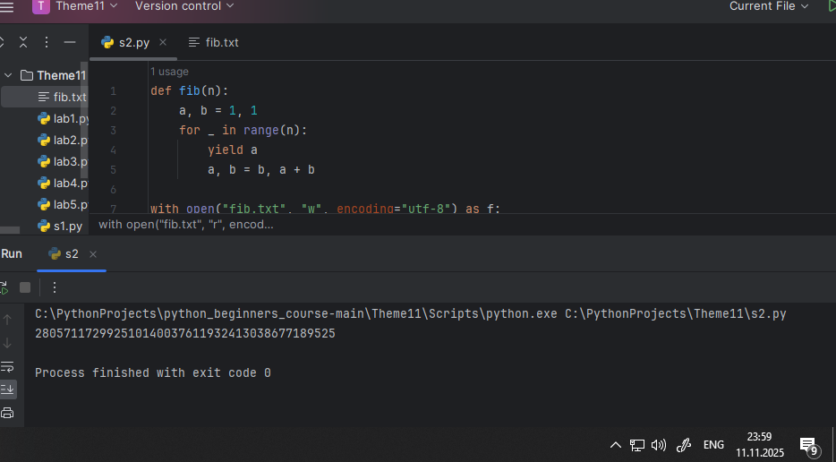

# Тема 11. Итераторы и генераторы
Отчет по Теме #11 выполнила:
- Шкабара Злата Александровна
- ПИЭ-23-1

| Задание | Лаб_раб | Сам_раб |
| ------ |---------|---------|
| Задание 1 | +       | +       |
| Задание 2 | +       | +       |
| Задание 3 | +       | -       |
| Задание 4 | +       | -       |
| Задание 5 | +       | -       |

знак "+" - задание выполнено; знак "-" - задание не выполнено;


## Лабораторная работа №1
### Простой итератор, но у него нет гибкой настройки, например его нельзя развернуть. Он работает просто как next(), но нет prev()

```python
numbers = [0, 1, 2, 3, 4, 5]
for item in numbers:
    print(item)
```
### Результат.


### Выводы

простой итератор

## Лабораторная работа №2
### Класс итератор с гибкой настройкой и удобными применением

```python
class CountDown:
    def __init__(self, start):
        self.count = start + 1

    def __iter__(self):
        return self

    def __next__(self):
        self.count -= 1
        if self.count < 0:
            raise StopIteration
        return self.count

counter = CountDown(5)
for i in counter:
    print(i)
```
### Результат.


### Выводы

создали класс итератора, настроив его под себя

## Лабораторная работа №3
### Генератор списка

```python
a = [i ** 2 for i in range(1, 5)]

print('a - ', a)
for i in a:
    print(i)

print('iter(a) - ', iter(a))
for i in a:
    print(i)
```
### Результат.


### Выводы

генератор списка
  
## Лабораторная работа №4
### Выражения генераторы

```python
b = (i ** 2 for i in range(1, 5))
print(b)
print('first')
for i in b:
    print(i)
print('second')

for i in b:
    print(i)
```
### Результат.


### Выводы

генератор 

## Лабораторная работа №5
### Такой же счетчик, как и в первом задании, только это генератор и использует yield

```python
def countdown(count):
    while count >= 0:
        yield count
        count -= 1

counter = countdown(5)
for i in counter:
    print(i)
```
### Результат.


### Выводы

применяем yield

## Самостоятельная работа №1
### Вас никак не могут оставить числа Фибоначчи, очень уж они вас заинтересовали. Изучив новые возможности Python вы решили реализовать программу, которая считает числа Фибоначчи при помощи итераторов. Расчет начинается с чисел 1 и 1. Создайте функцию fib(n), генерирующую n чисел Фибоначчи с минимальными затратами ресурсов. Для реализации этой функции потребуется обратиться к инструкции yield (Она не сохраняет в оперативной памяти огромную последовательность, а дает возможность “доставать” промежуточные результаты по одному). Результатом решения задачи будет листинг кода и вывод в консоль с числом Фибоначчи от 200

```python
def fib(n):
    a, b = 1, 1
    for _ in range(n):
        yield a
        a, b = b, a + b

fibonacci_list = list(fib(200))
print(fibonacci_list[-1])
```
### Результат.


### Выводы

1. Функция fib(n) принимает одно целое число n, которое указывает, сколько чисел Фибоначчи нужно сгенерировать
2. Внутри функции используются две переменные a и b, которые инициализируются значениями 1 и 1
3. После вызова функции fib(n), результат преобразуется в список
  
## Самостоятельная работа №2
### К коду предыдущей задачи добавьте запоминание каждого числа Фибоначчи в файл “fib.txt”, при этом каждое число должно находиться на отдельной строчке. Результатом выполнения задачи будет листинг кода и скриншот получившегося файла

```python
def fib(n):
    a, b = 1, 1
    for _ in range(n):
        yield a
        a, b = b, a + b

with open("fib.txt", "w", encoding="utf-8") as f:
    for num in fib(200):
        f.write(str(num) + "\n")

with open("fib.txt", "r", encoding="utf-8") as f:
    lines = f.readlines()
    print(lines[-1].strip())
```
### Результат.



### Выводы

1. добавлена конструкция with open("fib.txt", "w", encoding="utf-8") as f, которая открывает файл fib.txt для записи
2. внутри цикла for добавлена строка f.write(f"{a}\n"), которая записывает текущее число Фибоначчи в файл

## Общие выводы по теме
Базово освоила работу с итераторами в питоне
