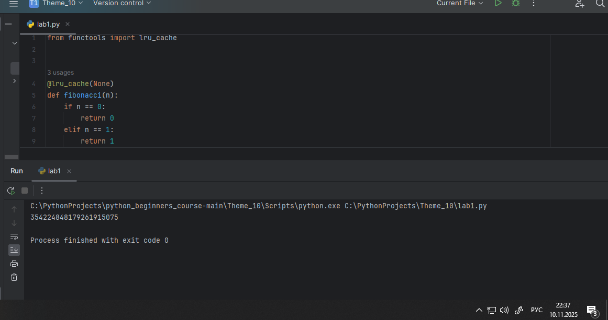
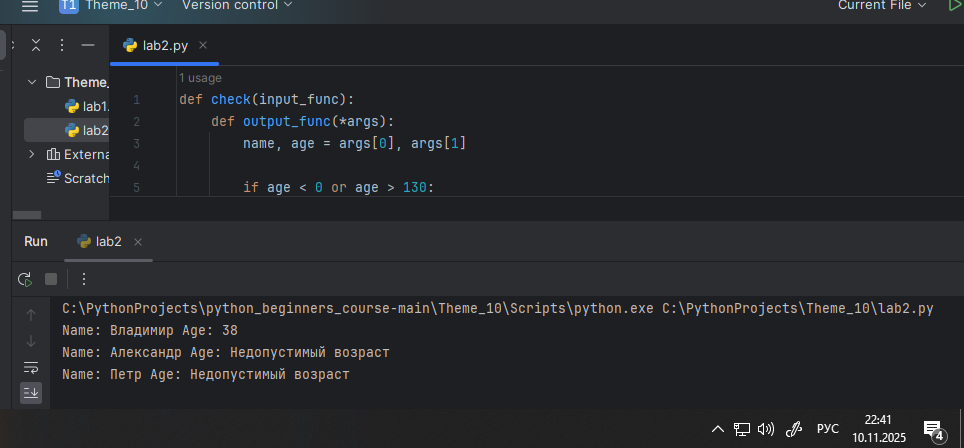
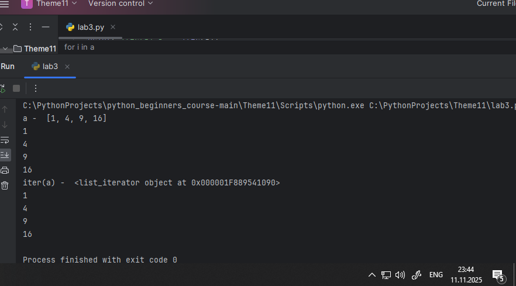
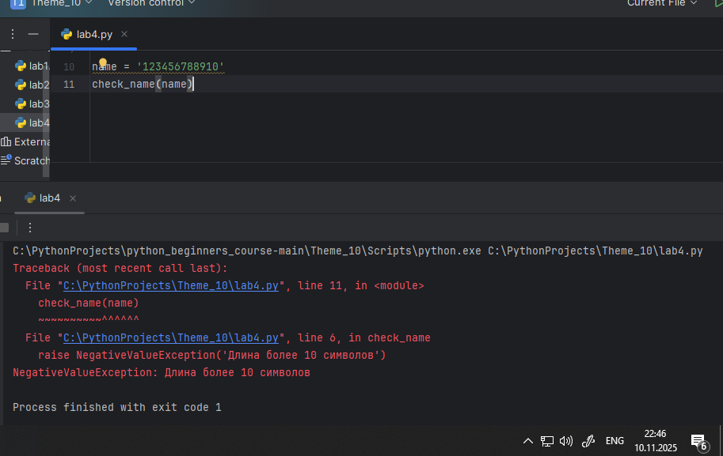
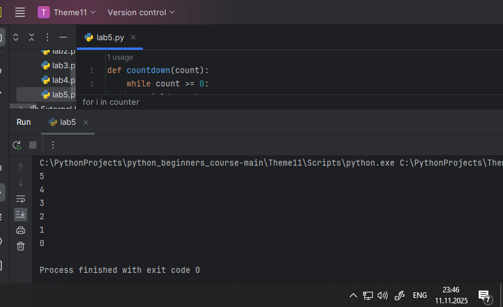
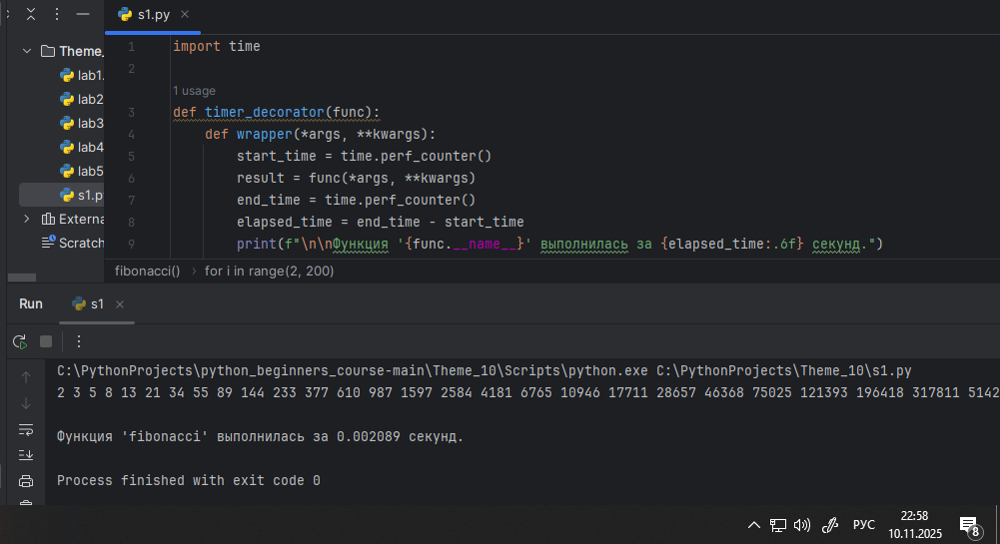
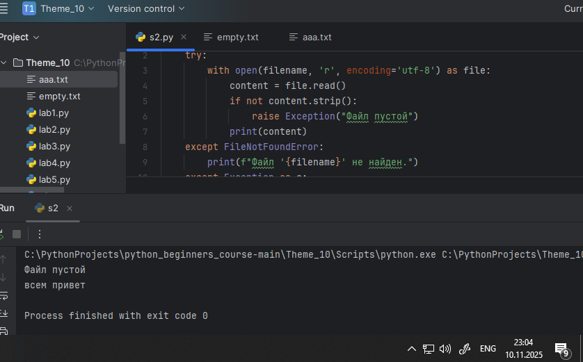
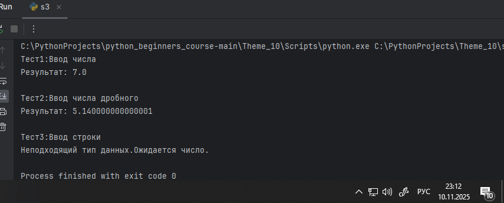
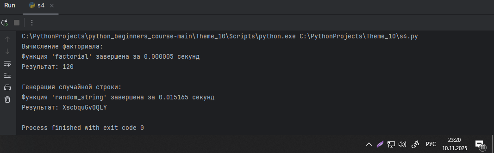
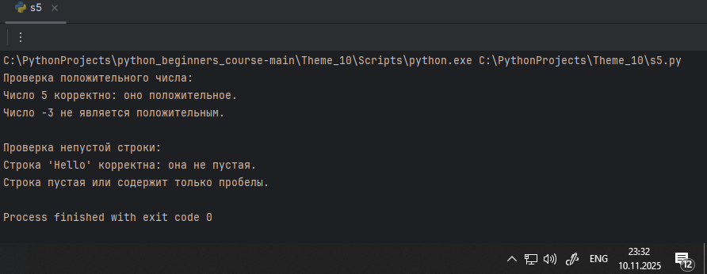

# Тема 10. Декораторы и исключения
Отчет по Теме #10 выполнил:
- Шкабара Злата Александровна
- ПИЭ-23-1

| Задание | Лаб_раб | Сам_раб |
| ------ |---------|---------|
| Задание 1 | +       | +       |
| Задание 2 | +       | +       |
| Задание 3 | +       | +       |
| Задание 4 | +       | +       |
| Задание 5 | +       | +       |

знак "+" - задание выполнено; знак "-" - задание не выполнено;


## Лабораторная работа №1
Наверняка вы думаете, что декораторы – это какая-то бесполезная  вещь, которая вам никогда не пригодится, но тут вдруг на паре по  математике преподаватель просит всех посчитать число Фибоначчи для  100. Кто-то будет считать вручную (так точно не нужно), кто-то  посчитает на калькуляторе, а кто-то подумает, что он самый крутой и  напишет рекурсивную программу на Python и немного огорчится,  потому что данная программа будет достаточно долго считаться, если ее просто так запускать. Но именно тут к вам на помощь приходят декораторы, например @lru_cache (он предназначен для решения задач динамическим программированием, если простыми словами, то этот декоратор запоминает промежуточные результаты и при рекурсивном вызове функции программа не будет считать одни и те же значения, а просто “возьмёт их из этого декоратора”). Вам нужно написать программу, которая будет считать числа Фибоначчи для 100 и запустить ее без этого декоратора и с ним, посмотреть на разницу во времени решения поставленной задачи.  P.S. при запуске без декоратора можете долго не ждать, для  наглядности хватит 10 секунд ожидания.
```python
from functools import lru_cache


@lru_cache(None)
def fibonacci(n):
    if n == 0:
        return 0
    elif n == 1:
        return 1
    return fibonacci(n - 1) + fibonacci(n - 2)

print(fibonacci(100))
```
### Результат.



### Выводы
запустили с декоратором и без

## Лабораторная работа №2
### Илья пишет свой сайт и ему необходимо сделать минимальную проверку ввода данных пользователя при регистрации. Для этого он реализовал функцию, которая выводит данные пользователя на экран и решил, что будет проверять правильность введённых данных при помощи декоратора, но в этом ему потребовалась ваша помощь.Напишите декоратор для функции, который будет принимать все параметры вызываемой функции (имя, возраст) и проверять чтобы возраст был больше 0 и меньше 130. Причем заметьте, что неважно сколько пользователь введет данных на сайт к Илье, будут обрабатываться только первые 2 аргумента.

```python
def check(input_func):
    def output_func(*args):
        name, age = args[0], args[1]

        if age < 0 or age > 130:
            age = 'Недопустимый возраст'
        input_func(name, age)

    return output_func


@check
def personal_info(name, age):
    print(f"Name: {name} Age: {age}")

personal_info('Владимир', 38)
personal_info('Александр', -5)
personal_info('Петр', 138, 15, 48, 2)
```
### Результат.



### Выводы
программа выводит имя и возраст, проверяя корректность возраста, а при некорректном значении заменяет его на сообщение Недопустимый возраст

## Лабораторная работа №3
### Вам понравилась идея Ильи с сайтом, и вы решили дальше работать вместе с ним. Но вот в вашем проекте появилась проблема, кто-то пытается сломать вашу функцию с получением данных для сайта. Эта функция работает только с данными integer, а какой-то недохакер пытается все сломать и вместо нужного типа данных отправляет string. Воспользуйтесь исключениями, чтобы неподходящий тип данных не ломал ваш сайт Также дополнительно можете обернуть весь код функции в try/except/finally для того, чтобы программа вас оповестила о том, что выявлена какая-то ошибка или программа успешно выполнена.

```python
def data(*args):
    try:
        for i in range(len(*args)):
            try:
                result = (args[0][i] * 15) // 10
                print(result)
            except Exception as ex:
                print(ex)
    except Exception as ex:
        print(ex)
    finally:
        print('Вся информация обработана')

data([1, 15, 'Hello', 'i', 'try', 'to', 'crash', 'your', 'site', 38, 45])
```
### Результат.



### Выводы
умножить каждый элемент переданного списка на 15 и разделить на 10, выводя результат для чисел и сообщение об ошибке для нечисловых значений
  
## Лабораторная работа №4
### Продолжая работу над сайтом, вы решили написать собственное исключение, которое будет вызываться в случае, если в функцию проверки имени при регистрации передана строка длиннее десяти символов, а если имя имеет допустимую длину, то в консоль выводиться “Успешная регистрация”

```python
class NegativeValueException(Exception):
    pass

def check_name(name):
    if len(name) > 10:
        raise NegativeValueException('Длина более 10 символов')
    else:
        print('Успешная регистрация')

name = '123456788910'
check_name(name)
```
### Результат.



### Выводы
код проверяет длину переданного имени и вызывает пользовательское исключение NegativeValueException, если длина превышает 10 символов

## Лабораторная работа №5
### После запуска сайта вы поняли, что вам необходимо добавить логгер, для отслеживания его работы. Готовыми вариантами вы не захотели пользоваться, и поэтому решили создать очень простую пародию. Для этого создали две функции: __init__() (вызывается при создании класса декоратора в программе) и __call__() (вызывается при вызове декоратора). Создайте необходимый вам декоратор. Выведите все логи в консоль.


```python
class SiteChecker:
    def __init__(self, func):
        print('> Класс SiteChecker метод __init__ успешный запуск')
        self.func = func

    def __call__(self):
        print('> Проверка перед запуском', self.func.__name__)
        self.func()
        print('> Проверка безопасного выключения')


@SiteChecker
def site():
    print('Усердная работа сайта')

print('>> Сайт запущен')
site()
print('>> Сайт выключен')
```
### Результат.



### Выводы
код реализует декоратор на основе класса


## Самостоятельная работа №1
### Вовочка решил заняться спортивным программированием на Python, но для этого он должен знать за какое время выполняется его программа. Он решил, что для этого ему идеально подойдет декоратор для функции, который будет выяснять за какое время выполняется та или иная функция. Помогите Вовочке в его начинаниях и напишите такой декоратор.

```python
import time

def timer_decorator(func):
    def wrapper(*args, **kwargs):
        start_time = time.perf_counter()
        result = func(*args, **kwargs)
        end_time = time.perf_counter()
        elapsed_time = end_time - start_time
        print(f"\n\nФункция '{func.__name__}' выполнилась за {elapsed_time:.6f} секунд.")
        return result
    return wrapper

@timer_decorator
def fibonacci():
    fib1 = fib2 = 1

    for i in range(2, 200):
        fib1, fib2 = fib2, fib1 + fib2
        print(fib2, end=' ')

if __name__ == '__main__':
    fibonacci()
```
    
### Результат


### Выводы
код оборачивает функцию в декоратор, который автоматически выводит сообщения до и после выполнения функции

## Самостоятельная работа №2
### Посмотрев на Вовочку, вы также загорелись идеей спортивного программирования, начав тренировки вы узнали, что для решения некоторых задач необходимо считывать данные из файлов. Но через некоторое время вы столкнулись с проблемой что файлы бывают пустыми, и вы не получаете вводные данные для решения задачи. После этого вы решили не просто считывать данные из файла, а всю конструкцию оборачивать в исключение, чтобы избежать такой проблемы. Создайте пустой файл и файл, в котором есть какая-то информация. Напишите код программы. Если файл пустой, то нужно вызвать исключение (“бросить исключение”) и вывести в консоль “файл пустой”, а если он не пустой, то вывести информацию из файла.

```python
def read_file_content(filename):
    try:
        with open(filename, 'r', encoding='utf-8') as file:
            content = file.read()
            if not content.strip():
                raise Exception("Файл пустой")
            print(content)
    except FileNotFoundError:
        print(f"Файл '{filename}' не найден.")
    except Exception as e:
        print(e)

read_file_content('empty.txt')
read_file_content('aaa.txt')
```
### Результат


### Выводы
программа читает файл, проверяет его на пустоту, и либо выводит содержимое, либо выбрасывает исключение 

## Самостоятельная работа №3
### Напишите функцию, которая будет складывать 2 и введенное пользователем число, но если пользователь введет строку или другой неподходящий тип данных, то в консоль выведется ошибка “Неподходящий тип данных. Ожидается число.”. Реализовать функционал программы необходимо через try/except и подобрать правильный тип исключения. Создавать собственное исключение нельзя. Проведите несколько тестов, в которых исключение вызывается и нет. Результатом выполнения задачи будет листинг кода и получившийся вывод в консоль.

```python
def add_two(user_input):
    try:
        number = float(user_input)
        result = 2 + number
        print(f"Результат: {result}")
    except ValueError:
        print("Неподходящий тип данных.Ожидается число.")


print("Тест 1: Ввод числа (целое)")
add_two("5")

print("\nТест 2: Ввод числа (дробное)")
add_two("3.14")

print("\nТест 3: Ввод строки")
add_two("hello")
```

### Результат


### Выводы
программа складывает числа, используя try/except и перехватывая valueerror, чтобы сообщить пользователю об ошибке

## Самостоятельная работа №4
### Создайте собственный декоратор, который будет использоваться для двух любых вами придуманных функций. Декораторы, которые использовались ранее в работе нельзя воссоздавать. Результатом выполнения задачи будет: класс декоратора, две как-то связанными с ним функции, скриншот консоли с выполненной программой и подробные комментарии, которые будут описывать работу вашего кода.

```python
class PerformanceLogger:                                   # Класс-декоратор
    def __init__(self, func):                              # Сохраняем оборачиваемую функцию
        self.func = func

    def __call__(self, *args, **kwargs):                   # Делает объект вызываемым
        import time                                        # Импорт внутри метода
        start = time.perf_counter()                        # Засекаем начало

        result = self.func(*args, **kwargs)                # Выполняем функцию

        end = time.perf_counter()                          # Засекаем конец
        print(f"Функция '{self.func.__name__}' завершена за {end - start:.6f} секунд")

        return result                                      # Возвращаем результат


@PerformanceLogger                                         # Применяем декоратор
def factorial(n):                                          # Вычисление факториала
    if n <= 1:
        return 1
    result = 1
    for i in range(2, n + 1):
        result *= i
    return result


@PerformanceLogger                                         # Применяем декоратор
def random_string(length=10):                              # Генерация случайной строки
    import random
    import string
    chars = string.ascii_letters + string.digits
    return ''.join(random.choice(chars) for _ in range(length))


if __name__ == '__main__':                                 # Точка входа
    print("Вычисление факториала:")
    print("Результат:", factorial(5))
    print()

    print("Генерация случайной строки:")
    print("Результат:", random_string(12))
```

### Результат


### Выводы
программа реализует собственный декоратор на основе класса

## Самостоятельная работа №5
### Создайте собственное исключение, которое будет использоваться в двух любых вами придуманных фрагментах кода. Исключения, которые использовались ранее в работе нельзя воссоздавать. Результатом выполнения задачи будет: класс исключения, две как-то связанными с ним функции, скриншот консоли с выполненной программой и подробные комментарии, которые будут описывать работу вашего кода.

```python
class InvalidInputError(Exception):                         # Собственное исключение 
    pass


def check_positive(number):                                # Проверяет, что число положительное
    if number <= 0:
        raise InvalidInputError(f"Число {number} не является положительным.")
    print(f"Число {number} корректно: оно положительное.")


def check_non_empty_string(text):                          # Проверяет, что строка не пустая 
    if not text.strip():
        raise InvalidInputError("Строка пустая")
    print(f"Строка '{text}' корректна: она не пустая")


if __name__ == '__main__':                                 # Точка входа в программу
    print("Проверка положительного числа:")
    try:
        check_positive(5)                                  # Корректный вызов
    except InvalidInputError as e:
        print(e)

    try:
        check_positive(-3)                                 # Некорректный вызов 
    except InvalidInputError as e:
        print(e)

    print("\nПроверка непустой строки:")
    try:
        check_non_empty_string("Hello")                    # Корректный вызов
    except InvalidInputError as e:
        print(e)

    try:
        check_non_empty_string("   ")                      # Некорректный вызов 
    except InvalidInputError as e:
        print(e)
```
### Результат



### Выводы
программа создаёт собственное исключение, которое используется в двух разных функциях для проверки входных данных

### Общие выводы
Базово освоила механизмы питона, такие как применение создание и применение декораторов, а также использование исключений
